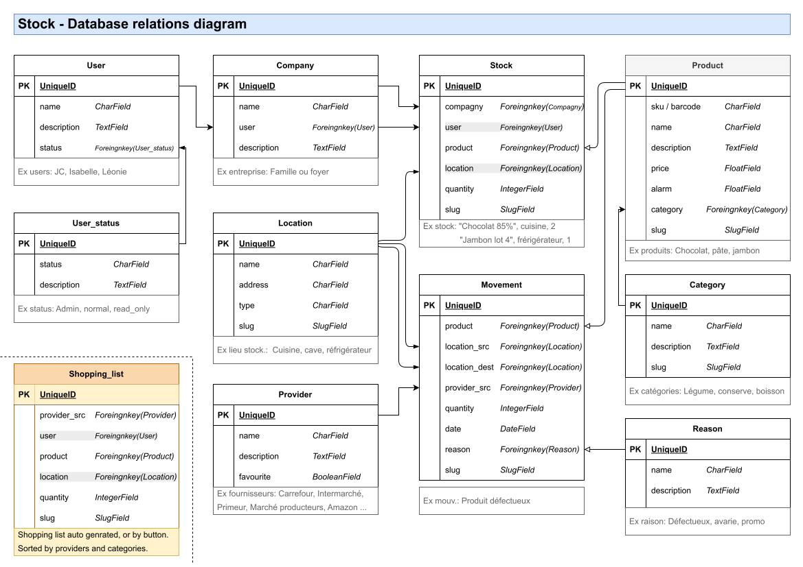

# Database relation diagram

**Notes:**
> The original specifications are adapted, like a hack, to our future family use.
> 
> The idea is to manage a family  alimentation storage and generated a shopping list.
> 
> I add a product categories and providers.
> 
> So the product location storage can be for example: kitchen, fridge, freezer, cellar.

